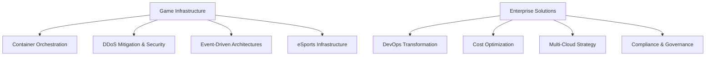

# 👋 Hi, I'm Serge Poueme
## Senior Solutions Architect

*Accomplished technology leader with 15+ years driving strategic cloud initiatives, architecting scalable solutions, and leading high-performing teams across gaming, fintech, and enterprise domains.*

---

### 🎮 Current Role & Impact
**Senior Solutions Architect at AWS** | *Game Backend & Infrastructure Focus Area Leader*

- 🚀 Leading AWS's Game Backend and Infrastructure global technical community
- 🌍 Collaborating with **specialists across 4 regions** supporting major game launches with **millions of concurrent users**
- 🎯 Drove **million dollars revenue AWS solutions architecture initiatives** scaling major gaming services to **100M+ players worldwide**
- 📈 Built gaming client's AWS community from **20 to 480 members** through **30+ thought leadership activities**

### 🏗️ Technical Expertise & Solutions

#### **Game Infrastructure & Scaling**
- **Kubernetes-based Game Infrastructure:** Leading open-source initiatives to drivie containers adoption for game servers
- **AWS EKS & Containers:** Official solution guidance for game server hosting on Amazon EKS with Agones/OpenMatch
- **Massive Scale Observability:** Designed Prometheus deployments supporting **600M+ active series, 70B+ samples/month**

#### **Enterprise Cloud Architecture**
- **DevOps Transformation:** Reduced deployment times from **6 months to 3 weeks** using Kubernetes, Jenkins & Spinnaker
- **Cost Optimization:** Delivered **$1M+ cost savings** through strategic cloud optimizations
- **Multi-Region Deployments:** Automated the management of a **fleet of Kubernetes clusters** across cloud and private data centers

#### **Business Impact & Leadership**
- **Revenue Growth:** Contributing to **significant YoY revenue growth** and enterprise customer success
- **Community Building:** Growing technical communities and delivered **17 workshops** on cloud-native technologies
- **Compliance & Security:** Led implementation of **GDPR, ISO 17799, PCI-DSSv2** in production environments

### 🛠 Technology Stack

```yaml
Cloud Platforms:    AWS (DevOps Pro, Solutions Architect Pro, Developer, Cloud Practitioner)
Containers:         Kubernetes, Amazon EKS, ECS, Docker, Agones, OpenMatch
Infrastructure:     Terraform, AWS CDK, CloudFormation, Spinnaker
Gaming:             Amazon GameLift, AWS Global Accelerator, Container-based game servers
Observability:      Prometheus, CloudWatch, Grafana, Distributed tracing
DevOps:             CI/CD, Jenkins, GitLab, CodePipeline, CodeBuild
Languages:          Go, Python, C, C++, Assembly, React, Javascript, Java, Infrastructure as Code
```

### 🎤 Speaking & Thought Leadership

- 🏆 **AWS Tier-2 Certified Speaker** | Average CSAT: **4.18/5.0**
- 🎯 **re:Invent Presentations:** 2021, 2022, 2023, 2024, 2025
- 📊 **AWS Summits & Tech Weeks:** CI/CD Best Practices, Container Scaling, CDK
- 🎮 **Game Developer Conferences:** Kubernetes for Games, eSports Infrastructure
- 📝 **AWS Gaming Blog:** Technical guidance, best practices, solution architectures

### 🎓 Education & Certifications

**Education:**
- 🎓 **Master of Engineering** - Industrial Engineering & Innovation Management, *Polytechnique Montreal*
- 🎓 **Bachelor of Engineering** - Software Engineering, *Polytechnique Montreal*

**AWS Certifications:**
- 🏅 [AWS Certified DevOps Engineer – Professional](https://aws.amazon.com/certification/certified-devops-engineer-professional/)
- 🏅 [AWS Certified Solutions Architect - Associate](https://aws.amazon.com/certification/certified-solutions-architect-associate/)
- 🏅 [AWS Certified Developer – Associate](https://aws.amazon.com/certification/certified-developer-associate/)
- 🏅 [AWS Certified Cloud Practitioner](https://aws.amazon.com/certification/certified-cloud-practitioner/)

### 🏆 Recognition & Awards

- 🌟 **SAP Catalyst** - (2018)
- 🥉 **3rd Prize** - Startupper of the Year by Total (2016)
- 🌍 **LOJIQ Prize** – New Markets and Export (2016)
- 🎯 **Semi-Finalist** - Echoing Green Global Fellowship (2015)
- 💡 **Desjardins Prize** – Workplace Health Innovation Challenge (2015)
- 🔋 **Ericsson Sustainovate Competition** Participant Recognition (2009)
- ⭐ **Ericsson Employee Recognition Award** (2009)
- 🔑 **Ericsson Key Contributor** (2008)

### 🎯 Areas of Focus



### 📈 Notable Achievements

- 🎮 **Game Server Innovation:** EKS-based game infrastructure solutions and reference architectures
- 💰 **Cost Optimization:** Delivered multi-million dollar cost savings across enterprise customers
- 👥 **Team Leadership:** Built and managed global technical communities of 480+ members
- 🚀 **Platform Scaling:** Reduced software deployment cycles from months to weeks
- 🔐 **Security Excellence:** Implemented enterprise compliance across critical gaming infrastructure

### 📫 Let's Connect

- 💼 **LinkedIn:** [Connect for cloud architecture discussions](https://www.linkedin.com/in/sergepoueme/)
- 🎯 **Technical Portfolio:** [Check what I am working on](portfolio.md)
- 🎤 **Speaking:** Available for conferences, workshops, and technical presentations
- 🤝 **Collaboration:** Open to cloud-native gaming infrastructure projects
- 📧 **Contact:** Available upon request

---

> *"Transforming how games scale in the cloud through innovative infrastructure solutions and community-driven technical excellence."*

**Currently focusing on:** Game infrastructure modernization, container orchestration at scale, and AI/ML integration for gaming workloads.
